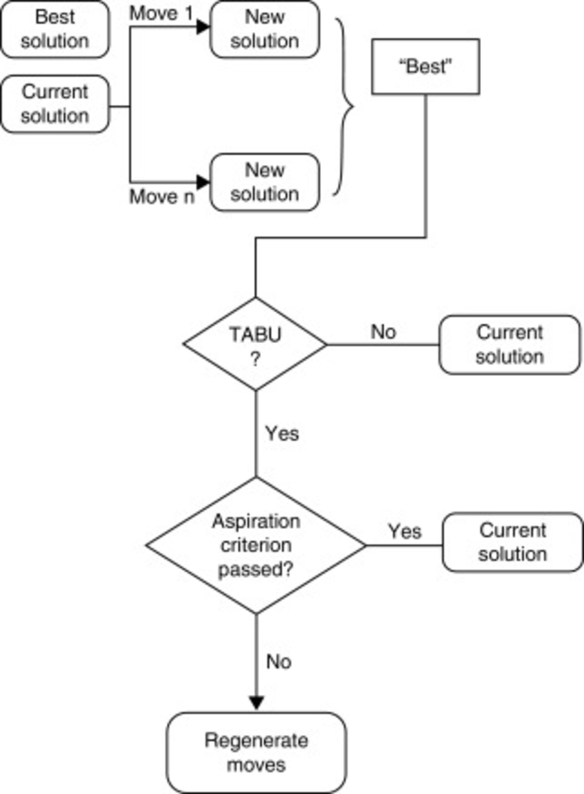
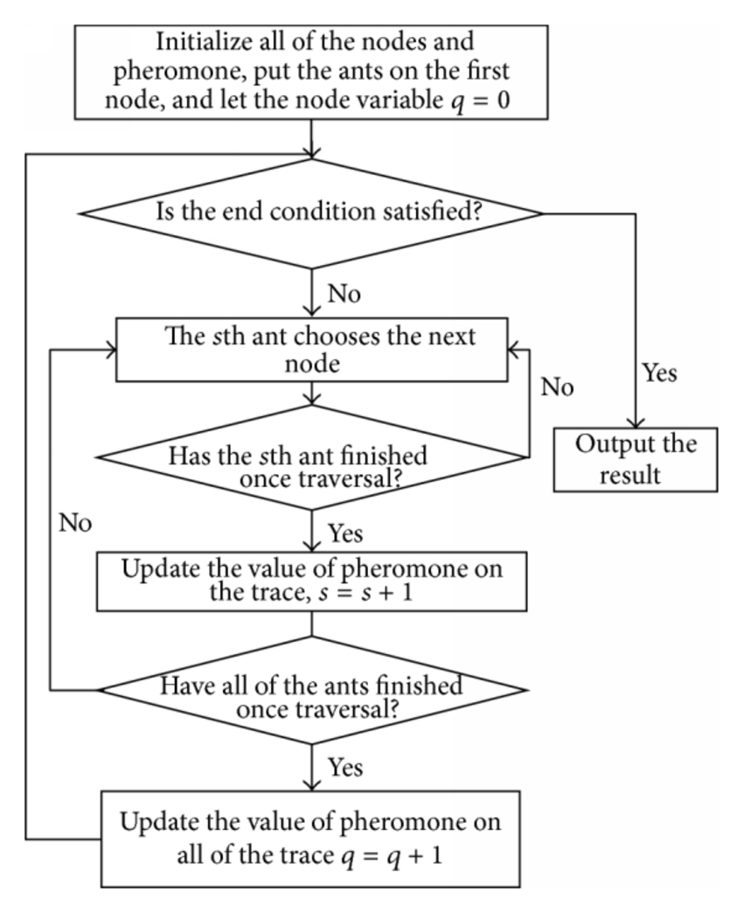

# Vehicle Routing Problem

Vehicle Routing Problem or simply VRP is a well known combinatorial optimization problem and a generalization of the 
travelling salesman problem. A definition of the problem is this: We have a number of customers that have a demand for 
a delivery. Which are the optimal (minimal) routes for a fleet of vehicles starting from a single point (depot) to 
deliver the requested goods in all customers. Finding optimal solution is a NP-hard problem so heuristic strategies 
are proposed for approximation of the optimal solution. For more about the problem see: 
https://en.wikipedia.org/wiki/Vehicle_routing_problem.

The variant of VRP that we are solving here is *Capacitated Vehicle Routing Problem (CVRP)*. It can formally be defined as 
follows:
  
  Let _G = (V, A)_ be a graph where _V_ is the vertex set and _A_ is the arc set.  One of the vertices represents 
  the depot at which a fleet of m identical vehicles of capacity _Q_ is based, and the other vertices customers 
  that need to be serviced.  With each customer vertex vi are associated a demand _qi_.  With each arc _(vi, vj)_ of _A_ 
  are associated a cost _cij_.  The _CVRP_ consists in finding a set of routes such that:
  
1. Each route begins and ends at the depot;
2. Each customer is visited exactly once by exactly one route;
3. The total demand of the customers assigned to each route does not exceed Q;
4. The total cost of the routes is minimized.

## Algorithms for solving VRP

To solve VRP we are using the following metaheuristic algorithms: *Tabu Search* with the initial solution generated 
with a Greedy Algorithm and *Ant Colony System*.

The instances used are from http://vrp.atd-lab.inf.puc-rio.br/index.php/en/ in the TSPLIB format described here: 
https://www.iwr.uni-heidelberg.de/groups/comopt/software/TSPLIB95/tsp95.pdf.

### Tabu Search

Tabu search is a metaheuristic search method employing local search methods. Local (neighborhood) searches take a 
potential solution to a problem and check its immediate neighbors (that is, solutions that are similar except for 
very few minor details) in the hope of finding an improved solution. Local search methods have a tendency to 
become stuck in suboptimal regions or on plateaus where many solutions are equally fit.

Tabu search enhances the performance of local search by relaxing its basic rule. First, at each step worsening moves 
can be accepted if no improving move is available (like when the search is stuck at a strict local minimum). 
In addition, prohibitions (henceforth the term tabu) are introduced to discourage the search from coming back 
to previously-visited solutions.

The following chart describes the steps taken in the tabu search algorithm:

The pseudo-code of the Tabu search algorithm:

         1 sBest ← s0
         2 bestCandidate ← s0
         3 tabuList ← []
         4 tabuList.push(s0)
         5 while (not stoppingCondition())
         6 	sNeighborhood ← getNeighbors(bestCandidate)
         7 	bestCandidate ← sNeighborHood.firstElement
         8 	for (sCandidate in sNeighborHood)
         9 		if ( (not tabuList.contains(sCandidate)) and (fitness(sCandidate) > fitness(bestCandidate)) )
        10 			bestCandidate ← sCandidate
        11 		end
        12 	end
        13 	if (fitness(bestCandidate) > fitness(sBest))
        14 		sBest ← bestCandidate
        15 	end
        16 	tabuList.push(bestCandidate)
        17 	if (tabuList.size > maxTabuSize)
        18 		tabuList.removeFirst()
        19 	end
        20 end
        21 return sBest

To find the best configuration for the Tabu parameters, irace has been used. irace is a R library described in the following paper: https://cran.r-project.org/web/packages/irace/vignettes/irace-package.pdf. The scenario used for irace to find
the best configuration can be found here: https://github.com/afurculita/VehicleRoutingProblem/tree/master/tuning/tabu. 
The best configuration obtained is:

| tabu  | iterations |  
| ----- | ----  |
| 7     | 19     | 

### Ant Colony System

_Ant Colony System (ACS)_ is an algorithmic approach inspired by the foraging behavior of real ants. Artificial ants
 are used to construct a solution for the problem by using the pheromone information from previously generated solutions.
 
 The following flowchart describes the ACS algorithm steps:
 

The current implementation of ACS for solving VRP is inspired by the paper "Applying the Ant System to the Vehicle 
Routing Problem" found at http://citeseerx.ist.psu.edu/viewdoc/download?doi=10.1.1.48.7946&rep=rep1&type=pdf.

To solve the VRP, the artificial ants construct vehicle routes by successively choosing cities to visit, until each city 
has been visited. Whenever the choice of another city would lead to an infeasible solution for reasons of vehicle capacity,
the depot is chosen and a new tour is started. For the selection of a (not yet visited) city, two aspects are taken into 
account: how good was the choice of that city, an information that is stored in the pheromone trails _τ(i, j)_ associated 
with each arc _(vi; vj)_, and how promising is the choice of that city. This latter measure of desirability, called
visibility and denoted by _η(i, j)_ , is the local heuristic function mentioned above. In the case of the VRP (or the 
TSP) it is defined as the reciprocal of the distance, i.e. _η(i, j) = 1/d(i, j)_.

The next city to be visited is selected according to a random-proportional rule _p(i, j)_, biased by the parameters 
_α_ and _β_ that determine the relative influence of the trails and the visibility, respectively.

After an artificial ant _k_ has constructed a feasible solution, the pheromone trails are laid depending on the 
objective value _L(k)_. For each arc _(vi, vj)_ that was used by ant _k_, the pheromone trail is increased by _1/L(k)_. 
In addition to that, all arcs belonging to the so far best solution (objective value _M_) are emphasized as if _σ_ ants,
so-called _elitist ants_ had used them. One elitist ant increases the trail intensity by an amount equal to _1/M_
if arc _(vi, vj)_ belongs to the so far best solution, and zero otherwise. Furthermore, part of the existing pheromone 
trails evaporates.

Concerning the initial placement of the artificial ants it was found that the number of ants should be equal to the 
number of cities in the TSP, and that each ant should start its tour from another city. The implication for the VRP 
is that as many ants are used as there are customers in the VRP (i.e. _m = n_), and that one ant is placed at each 
customer at the beginning of an iteration. After initializing the basic ant system algorithm, the two steps 
_construction of vehicle routes_ and _trail update_, are repeated for a given number of iterations.

To find the best configuration for the ACS parameters, irace has been used. The scenario used for irace to find
the best configuration can be found here: https://github.com/afurculita/VehicleRoutingProblem/tree/master/tuning/acs.
The best configuration obtained is:

| alpha | beta |  rho | omega |   q0  | iterations |
| ----- | ---- | ---- | ----- | ----- | ---------- |
| 1.95   | 4.76 | 0.66 | 0.85  | 0.48  |     20    | 

## Results

| Instance | Dimension | ACS before optim. | ACS after optim. | Tabu before optim. | Tabu after optim. | Optimal value | 
| ----- | ---- | ---- | ----- | ----- | ---------- | ----------- |
| A-n32-k5 | 32      | 984.44       | 863.15                 | 903.7                    | 822.86             | 784        |
| A-n60-k9 | 60      | 1737.50      | 1629.55                | 1464.09                  | 1460.51           | 1408 |
| A-n80-k10| 80      | 2137.22      | 2043.01                | 1845.08                  | 1833.87            | 1764 |
| B-n78-k10| 78     | 1503.56      | 1479.05                | 1421.76                  | 1421.52             | 1266 |
| P-n101-k4| 101    | 917.17      | 883.51                 | 771.68                   | 757.24             | 681 |
| Golden_20| 421    | 2305.47      | 2282.83                | 2503.03                   | 2502.39            | 1820.09 |

## Conclusions

 1. ACS and Tabu Search are good options for solving VRP
 2. ACS depends a lot on how are its parameters defined
 3. There is no guarantee to obtain optimal solutions; it depends on a probabilistic factor
 4. Tabu Search is much better than ACS for solving VRP
